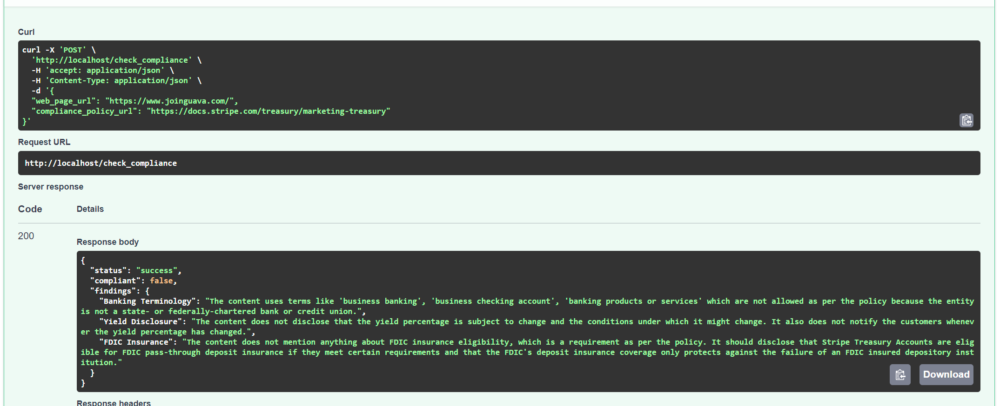
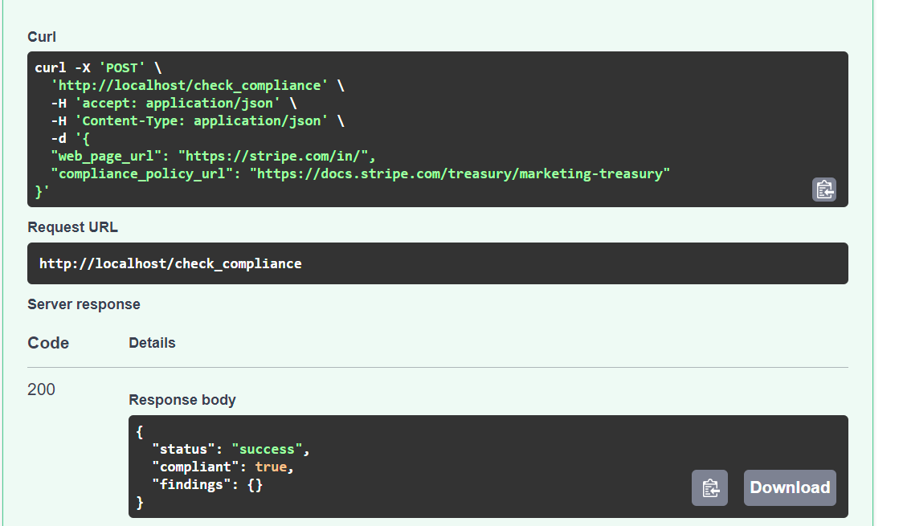

# llms-for-compliace

## Description
This service checks the webpage copy against the compliance policy and reports the findings.
This is currently powered by AZURE OPENAI API which is using GPT-4 model to generate the compliance report.

## Steps to run the service
1. Clone the repository
2. Set the configurations in configurations.py, update azure key and deplyoment url.

#### Docker run
2. Run the following command to build the docker image
```docker build -t llms-for-compliance .```
3. Run the following command to run the docker container
```docker run -p 80:80 llms-for-compliance```
4. The service will be running on http://localhost:80

#### Local run
2. Run the following command to install the dependencies
```pip install -r requirements.txt```
3. Run the following command to start the service
```python main.py```
4. The service will be running on http://localhost:80

### API Endpoints
1. POST /compliance-check
    - Request Body: 
    ```
    {
        "web_page_url": "The webpage url will be here",
        "compliance_policy_url": "The compliance policy will be here"
    }
    ```
    - Response:
    ```
    {
        "status": "The status of the api will be here",
        "compliant": "The compliance status will be here",
        "findings": "The findings(non-compliant results) will be here"
    }
    ```

### Architecture
We majorly have 3 modules in the architecture:
1. Configurations: This module is responsible for setting the configurations for the service. We can set the configurations for the service in the configurations.py file.
2. Extract: This module is responsible for extracting any webpage url given to it. It uses Goose to extract the webpage content. We can later on include any kind of media in this module using builder design used in llm module.
3. LLM: This module is responsible for checking the compliance of the webpage content against the compliance policy. This module also includes a builder to plug and use any kind of llm for the compliance check. Currently, we are using Azure OpenAI API to check the compliance.


### Results
1. Compliance Check for https://www.joinguava.com/ against the compliance policy https://www.joinguava.com/compliance-policy
    - Request:
    ```
    {
        "web_page_url": "https://www.joinguava.com/",
        "compliance_policy_url": "https://docs.stripe.com/treasury/marketing-treasury"
    }
    ```
    - Response:
    ```
    {
        "status": "success",
        "compliant": false,
        "findings":   "findings": {
                                   "Banking Terminology": "The content uses terms like 'business checking account', 'banking', and 'bank accounts' which are prohibited for use by entities that are not state- or federally-chartered banks or credit unions.",
                                   "Yield Disclosure": "The content does not disclose that the yield percentage is subject to change and the conditions under which it might change. It also does not notify customers whenever the yield percentage has changed.",
                                   "FDIC Insurance": "The content does not mention anything about FDIC insurance eligibility, the conditions for FDIC pass-through deposit insurance, or the fact that neither the platform nor Stripe are FDIC insured institutions."
                                    }
   }
    ```
    - Screenshot:



2. Compliance Check for https://www.stripe.com/ against the compliance policy https://www.joinguava.com/compliance-policy
    - Request:
    ```
    {
        "web_page_url": "https://www.stripe.com/",
        "compliance_policy_url": "https://docs.stripe.com/treasury/marketing-treasury"
    }
    ```
    - Response:
    ```
    {
        "status": "success",
        "compliant": true,
        "findings": {}
    }
    ```
    - Screenshot:
   
   

### Future Scope
1. We can include more llms for the compliance check.
2. We can include more extractors for the webpage content.
3. We can try some other techniques to check the compliance of the webpage content. 
   1. We can call llm multiple times to extract key information from the compliance policy and use that to validate the webpage content, the prompt implementation of this is already in the prompts file, but the results were bit out of control and hence decided to go with simpler approach. I believe we can achieve better results with some prompt engineering work.
4. We can fine-tune the llms to give controlled and better results.
